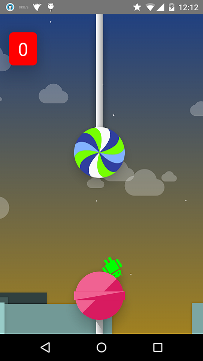

egg
===

The android 5.0 hidden Egg game.

This is a small flappy-bird like game extracted from Android 5.0 source code.

You can find full source code [here](https://android.googlesource.com/platform/frameworks/base/+/lollipop-release/packages/SystemUI/src/com/android/systemui/egg/).

Now the game can only run on Android 5.0 (API level 21) or high because it invokes some Android 5.0 specific api like [TextView.translationZ](http://developer.android.com/reference/android/view/View.html#setTranslationZ(float))

**JUST FOR STUDY PURPOSE!!!**

